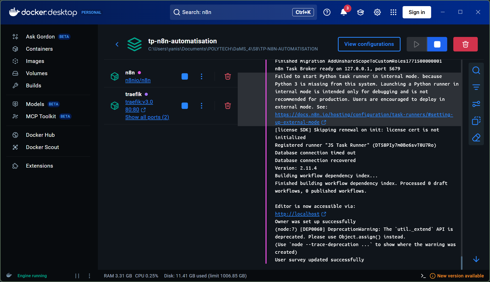
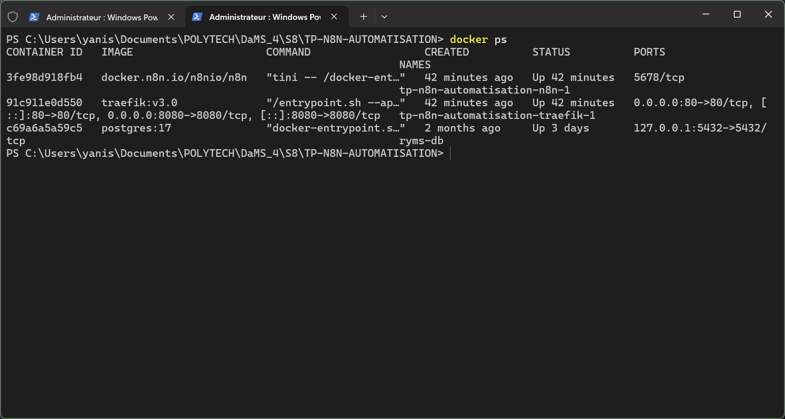

# Guide d'installation

0. [Génération de clefs SSL (Optionnel)](#0-génération-de-clés-ssl-optionnel)
1. [Installation Prérequis](#1-prérequis)
2. [Installation de n8n en self-host avec Docker](#-2-installation-de-n8n-en-self-host-avec-docker)
    1. [Docker](#avec-docker)
    2. [Docker Compose](#avec-docker-compose)

---

## 0. Génération de clés SSL (Optionnel)

Avant d'installer n8n, si vous souhaitez sécuriser vos échanges en local, il est recommandé de générer un certificat SSL.

### Installation de OpenSSL sur Windows

Si vous n'avez pas OpenSSL, vous pouvez l'installer rapidement via le gestionnaire de paquets Windows (**winget**).

Ouvrez un terminal (PowerShell ou CMD) en mode **administrateur** :

```powershell
winget install openssl

```

> *Note : Après l'installation, il peut être nécessaire de redémarrer votre terminal pour que la commande `openssl` soit reconnue.*

### Création d'un certificat auto-signé

Pour générer une clé privée et un certificat (valable 365 jours), utilisez la commande suivante dans votre dossier de projet :

```bash
cd DOCKER/cert
openssl req -x509 -newkey rsa:4096 -keyout key.pem -out cert.pem -sha256 -days 365 -nodes

```

Cette commande va créer deux fichiers :

* `key.pem` : Votre clé privée.
* `cert.pem` : Votre certificat.

## 1. Prérequis

Pour pouvoir utiliser n8n, il vous faudra ces prérequis : 
> - Docker Desktop ou docker,
> - Une connexion internet,
> - Git pour le contenu du TP.

Avant de commencer le TP il faudra le cloner.

```
git clone https://github.com/Askneuh/TP-N8N-AUTOMATISATION.git
```

## 🛠 2. Installation de n8n en self-host avec Docker

### Avec Docker

#### Prérequis

Avoir docker sur sa machine

#### Lancement de l'instance

Ouvrez un terminal et collez la commande suivante :
```
docker volume create n8n_data

docker run -it --rm \
 --name n8n \
 -p 5678:5678 \
 -v n8n_data:/home/node/.n8n \
 docker.n8n.io/n8nio/n8n
```

Une fois le conteneur démarré, accédez à l'interface sur : [http://localhost:5678](http://localhost:5678)

### Avec Docker Compose

Dans le dossier ``DOCKER`` vous allez retrouver un ficher ``.env`` et un fichier ``docker-compose.yaml`` il s'agit d'un docker compose pour tester n8n pour le développement. 

**Attention ! :  Vos port 80 et 8080 devront être libres !**

```
cd DOCKER

docker compose up -d
```
---

A partir de ce stade, vous devriez voir cela dans docker desktop ou dans ``docker ps`` : 

|||
|--|--|

Avec Docker compose il vous suffira d'allez sur [http://localhost](http://localhost)
