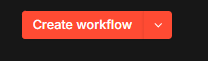
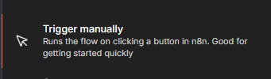
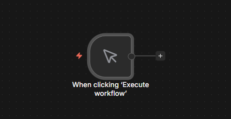
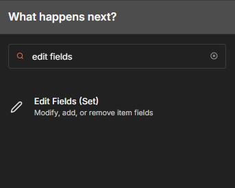
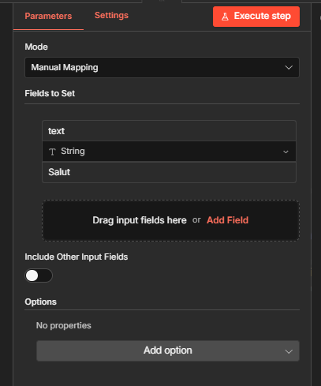
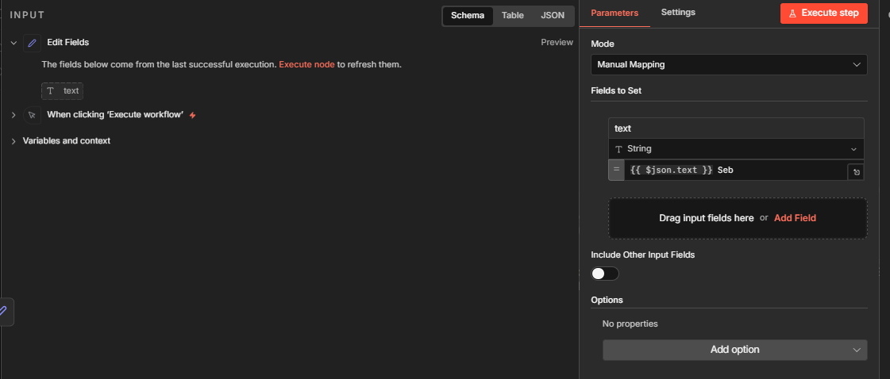

# TP : Automatisation de Workflow avec n8n 🚀

## 🎯 Objectifs
- Maîtriser les fondamentaux de n8n : Comprendre l'architecture Trigger/Action et la circulation des données entre les nœuds.

- Déployer une solution d'automatisation : Installer et configurer n8n en local via Docker.

- Exploiter l'Intelligence Artificielle : Intégrer des agents IA (Gemini/Groq) pour transformer des documents non structurés (PDF) en contenu personnalisé.

- Connecter des services tiers via API : Configurer un Compte de Service Google Cloud pour automatiser l'édition de documents Google Docs.

- Manipuler la donnée : Apprendre à extraire du texte d'un fichier binaire et à structurer des sorties JSON pour des outils externes.

---

## 💎 1. Pourquoi automatiser ? (10 min)
Aujourd'hui, on utilise tous des dizaines d'outils : Gmail, Drive, Instagram, Discord, GitHub... Le souci, c'est que ces applications ne communiquent pas entre elles. Résultat : on passe un temps fou à faire du "copier-coller" manuel, à déplacer des fichiers ou à remplir des tableaux. C'est lent, c'est ennuyeux et c'est une perte de temps.
n8n est un outil qui permet de faire "communiquer" vos applications entre elles à travers des workflows.

L'automatisation permet de supprimer les tâches répétitives à faible valeur ajoutée (saisie de données, transferts d'emails, surveillance de prix).

Il existe plusieurs outils d'automatisations, tels que Zapier ou Make, cependant, n8n se distingue par plusieurs critères :
- **Le concept "Fair-Code"** : n8n est auto-hébergeable (pas besoin de passer forcément par le cloud pour l'utiliser). Cela implique qu'il est possible de l'installer sur vos propres serveurs si vous en avez, ce qui peut réduire les coûts, et cela implique aussi qu'en se faisant, vous gardez un contrôle sur vos données.
- **Le "Low-Code"** : Dans Zapier ou Make, on peut créer des workflows, mais on ne peut pas insérer des scripts, ce qui réduit le nombre de possibilités d'utilisation. Dans n8n, on peut injecter des scripts JavaScript ou Python pour plus de flexibilité.

## ⚙️ 2. Installation et Déploiement (20 min)
Suivez les instructions spécifiques du fichier **[INSTALLATION_GUIDE.md](./INSTALLATION_GUIDE.md)** pour déployer l'outil sur votre machine.

## 🔍 3. Découverte de l'interface (15 min)

Une fois que vous arrivez sur l'interface, vous tombez sur la page qui répertorie tout vos workflows, si vous êtes vraiment nouveaux sur n8n, vous n'aurez encore aucun workflow.

### Créer un nouveau workflow
Créez en un nouveau. Pour cela cliquez soit sur le bouton **create workflow** en haut a droite, soit sur le **+** en haut a gauche, puis workflow.

Vous accédez alors à l'espace de travail, appelé **canva**.
L'architecture d'un workflow se compose toujours :
1. d'un noeud de trigger (**trigger node**), qui active le flux.
2. de **noeuds d'actions**, qui définissent ce que le workflow fait à chaque étape.
3. et de **flux de données** qui circulent au fil des étapes.

### Ajouter la Trigger Node
Pour créer la trigger node, cliquez sur le **+** au milieu de votre écran.

  

Un onglet s'ouvrira à droite de votre écran et vous aurez le choix entre différentes nodes. Pour le premier exemple, sélectionner la node **Trigger Manually**, de sorte que vous puissiez lancer le workflow quand bon vous semble.

  

Le noeud apparaît alors sur votre espace de travail :

  

### Configurer une action
Pour ajouter une node d'action, cliquez sur le plus a droite de la trigger node. Dans le menu à droite, vous aurez le choix à une multitude d'actions différentes.
Pour ce premier exemple, sélectionner le noeud **Edit Field** (vous pouvez le taper dans la barre de recherche).

  

Comme le noeud est le premier du workflow et que le trigger ne fait passer aucune donnée, nous allons créer une variable a faire passer dans notre workflow. Ajoutez un champ de type **String**, et rentrez comme valeur quelque chose comme **"Salut"**, n'oubliez pas de mettre un nom.

  

Sortez de l'interface en appuyant sur échappe par exemple, et éxecuter le workflow. Vous ne devriez pas avoir d'erreur mais pour l'instant, rien de particulier ne se produit.

### Passer des données entre les noeuds
Vous avez simplement créé un champ textuel et l'avez fait passé en output de votre node. Cliquez a nouveau sur le bouton **+** a droite de la node edit fields, et ajoutez a nouveau une node **Edit Fields**.

Cette fois, dans l'onglet **Input** à gauche, vous devriez voir la variable que vous avez définie précédemment.

  

Créez un champ textuel, et glissez la variable dans la valeur, puis ajoutez votre nom par exemple. Exécutez le workflow complet, vous pourrez voir s'afficher l'output final du workflow. Ceci était un exemple vraiment minimaliste de ce que l'on peut faire avec n8n, pour vous introduire les concepts essentiels. Il existe plein de nodes qui permettent d'interagir avec des applications comme google sheets, discord, telegram etc... et même avec des Agents IA. Un exercice permettant la création d'un workflow un peu plus complet vous est proposé par la suite.

---

## 🛠️ Mise en pratique

L'objectif de cet exercice est de créer un workflow qui récupère votre CV ainsi qu'une offre de stage/d'emploi, et qui vous rédige une lettre de motivation personnalisée. Les instructions seront moins précises que pour l'exemple de découverte, mais n'hésitez pas à nous appeler si vous avez la moindre question. Le code du workflow complet est aussi disponible sur github, sous format json, vous pouvez le télécharger et l'importer dans n8n si besoin.

### 1. Récupération des données
La première étape consiste à récupérer votre CV et votre offre d'emploi. Cela peut se faire dans la trigger node.

* Ajoutez la trigger node **n8n form** à votre canva.
* Ajoutez deux form elements :
    * Un de type **text** (pour l'offre d'emploi).
    * Un de type **file** (pour le CV en PDF).
* Pour l'élément CV, rajoutez l'attribut **Accepted file**, et rentrez `.pdf`.
* Nommez le label significativement et vous pouvez aussi ajouter l'attribut **required field**.

### 2. Extraction du texte du CV
Ensuite, nous voulons extraire les informations de votre CV, en effet, l'agent IA que nous utiliserons par la suite ne peut pas directement lire le pdf.

* Ajoutez la node **Extract from File**.
* Sélectionnez **Extract From PDF**.
* Dans le champ input, glissez l'input du PDF.
* Ce noeud convertira le contenu du pdf en texte pour que l'agent puisse l'utiliser.

### 3. Configuration de l'Agent IA
Ok, on va maintenant ajouter notre agent IA.

* Ajoutez un nouveau noeud et sélectionnez **AI -> AI Agent**.
* Il vous faudra ajouter un modèle à cet agent : cliquez sur le **+** là où il y a écrit **chat model**.
* Choisissez un modèle gratuit et rapide d'accès (ex: **Google Gemini** ou **Groq**). Créez ensuite une clé d'API (pour Gemini : [aistudio.google.com](https://aistudio.google.com/app/apikey)) et ajoutez-la en *credential*.

### 4. Rédaction du Prompt
Une fois cela fait, vous pouvez rentrer le prompt. Voici un exemple que vous n'êtes pas obligé de suivre (il peut être amélioré), mais pour notre exemple, cela peut suffire :

> **Prompt :**
> Voici le contenu de mon CV :
> `{{ $json.text }}`
>
> Et voici une offre d'emploi : `{{ $('Upload your file here').item.json.offer }}`
>
> Je veux que tu me rédige une lettre de motivation adaptée à cette offre en utilisant ce qu'il y a sur mon CV, la lettre de motivation doit montrer mon intérêt pour le poste et pour la boite.
> Ne met pas de texte supplémentaire

⚠️ **Note :** Remplacez les balises par les bons noms de vos variables. Si les noms sont corrects, ils doivent être affichés en vert dans l'interface n8n.

### 5. Insertion dans Google Docs (Exercice Avancé)
Pour clôturer ce TP, nous allons insérer automatiquement la lettre générée par l'IA dans un fichier Google Docs. Google imposant des normes de sécurité strictes, cette étape demande de paramétrer rigoureusement un **Compte de Service** (Service Account).

#### A. Création du Compte de Service Google
1. Accédez à la [Google Cloud Console](https://console.cloud.google.com/) et connectez-vous avec un compte Google.
2. Cliquez en haut à gauche pour **Créer un projet** (donnez-lui le nom de votre choix).
3. Dans la barre de recherche en haut, tapez `Google Docs API` et cliquez sur **Activer**. (Faites de même pour la `Google Drive API` pour éviter tout souci de droits lors du partage).
4. Ouvrez le menu latéral > **API et services** > **Identifiants**.
5. Cliquez sur **+ CRÉER DES IDENTIFIANTS** et sélectionnez **Compte de service**.
6. Nommez le compte (ex: `n8n-bot`), cliquez sur *"Créer et continuer"*, puis sur *"OK"*.
7. Dans la liste des Comptes de Service en bas de page, copiez **l'adresse e-mail** de ce bot algorithmique (elle ressemble à `n8n-bot@...gserviceaccount.com`).
8. Cliquez sur ce compte pour l'ouvrir, allez dans l'onglet **CLÉS**, puis **AJOUTER UNE CLÉ** > **Créer une clé**.
9. Sélectionnez le format **JSON** et cliquez sur **Créer**. Un fichier `json` contenant vos accès va se télécharger sur votre ordinateur. Gardez-le précieusement ouvrez-le avec un éditeur de code, vous en aurez besoin !

#### B. Autorisation sur le Document
1. Ouvrez votre **Google Drive** personnel et créez un nouveau document vierge *Google Docs*.
2. Cliquez sur le bouton bleu **Partager** en haut à droite.
3. Collez **l'adresse e-mail** du Compte de Service copiée à l'étape A.7 et octroyez-lui le rôle **Éditeur**. *Sans ça, n8n sera incapable de modifier le document !*
4. **Important** : Gardez l'URL de votre document Google Docs sous la main pour l'exécution du test.

#### C. Configuration côté n8n
1. Juste après votre premier noeud **AI Agent**, utilisez un nouveau noeud **Edit Fields (Set)** pour sauvegarder la lettre générée sous le nom `reponse`.
2. L'API Google Docs n'accepte pas nativement le formatage Markdown généré systématiquement par les IA, il a besoin de texte brut. La meilleure solution est d'ajouter un **deuxième Agent IA** (formatteur), lié à un noeud **Structured Output Parser**. Donnez-lui pour instruction de séparer le texte précédent (votre `reponse`) en un objet JSON rigoureux qui partitionne un *"objet"* (le titre) et le *"contenu"*.
3. Enfin, ajoutez le noeud final **Google Docs** à votre Canva et configurez-le :
   - **Credential** : Créez un nouveau `"Google Docs API"`, sélectionnez l'authentification **Service Account** et copiez-collez l'intégralité du texte de la clé JSON téléchargée à l'étape A.9.
   - **Operation** : `Update`. En *Document URL*, insérez dynamiquement l'URL de votre GDocs récupérée dans le point B ou depuis votre déclencheur Form Trigger.
   - **Actions** : Ajoutez des champs *Insert* pour y glisser dynamiquement (grâce aux nodes en vert) les variables de votre deuxième IA (soit l'objet, puis à la ligne le contenu).

### 6. Test du Workflow complet
* Cliquez sur le bouton **Test Workflow** au bas de n8n.
* Ouvrez l'URL de test de votre formulaire et remplissez l'offre d'emploi, uploadez un CV PDF, et **ajoutez bien l'URL de votre Google Docs vierge**.
* Lancez l'automatisation depuis le web-formulaire, retournez sur n8n, et suivez en direct la magie s'opérer dans votre document Google !

